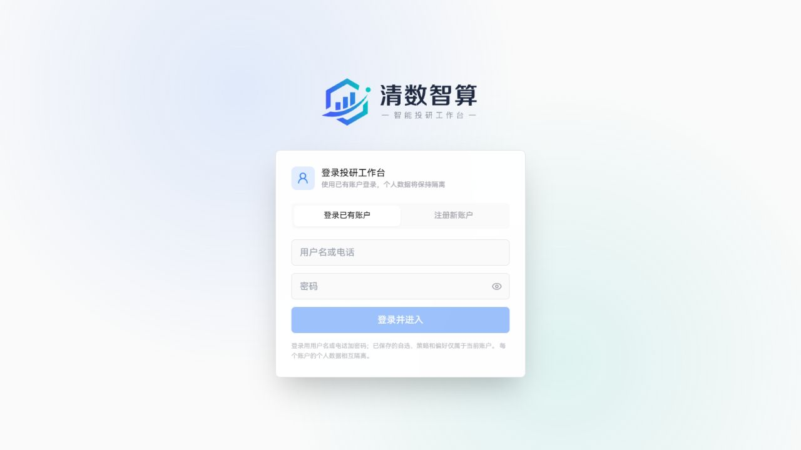
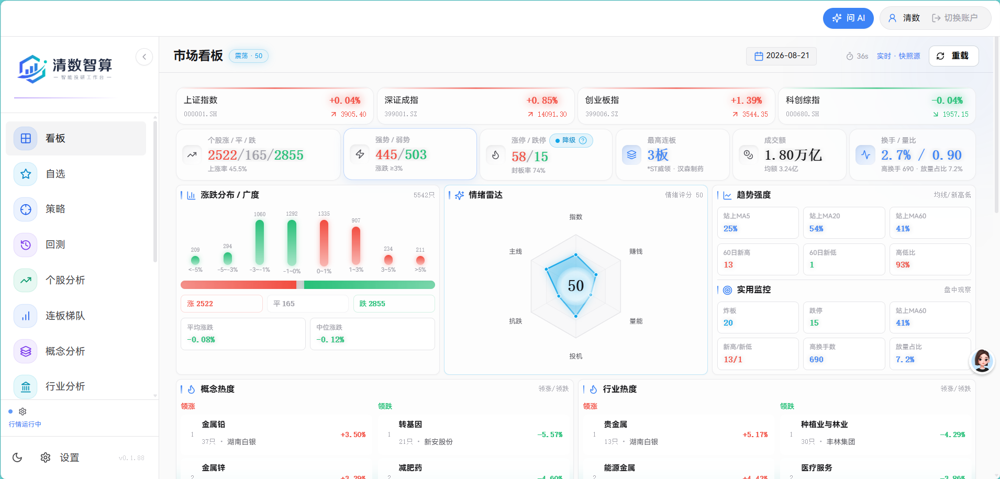
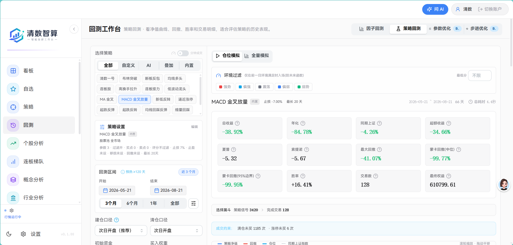
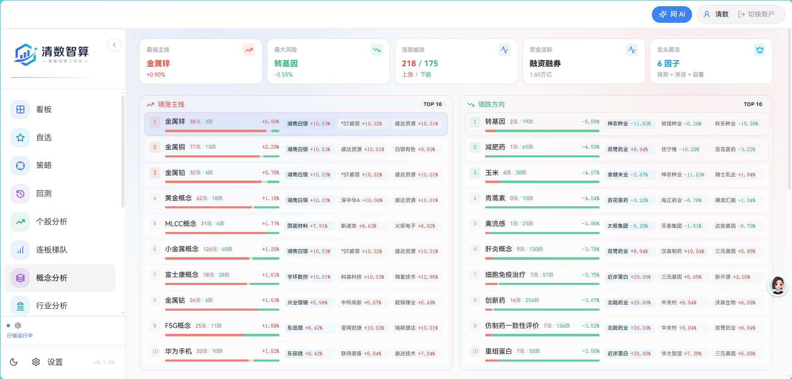
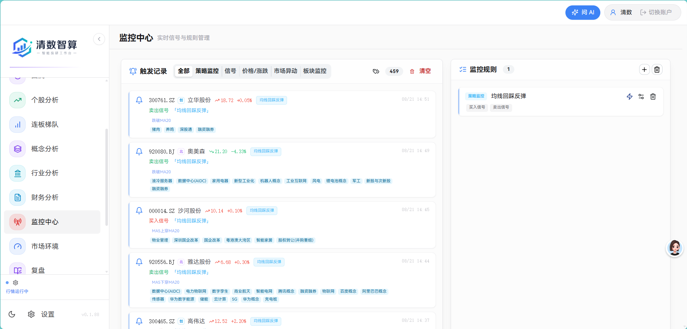
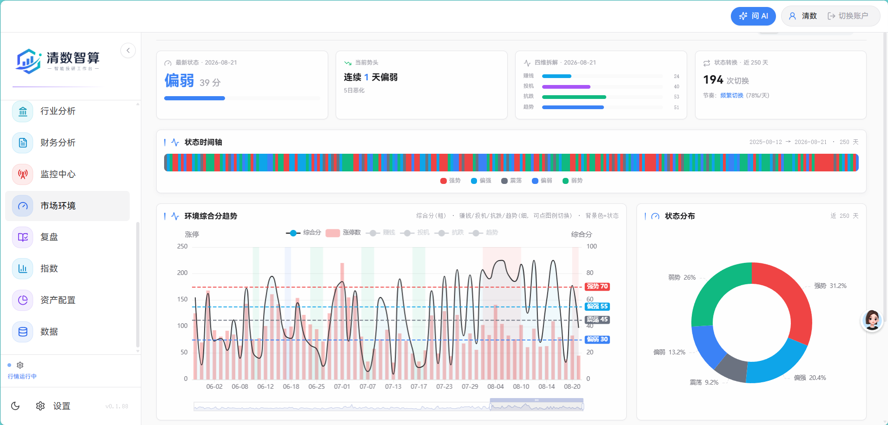
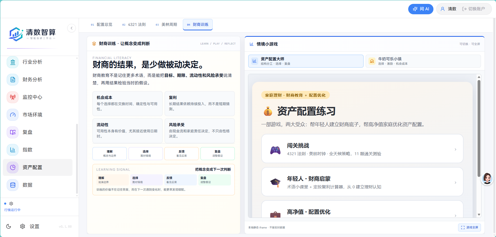

<div align="center">

# 清数智算 · 智能投研工作台

**TickFlow Stock Panel**

面向 A 股研究、策略验证、行情监控与账户隔离的自托管投研工作台

[](./LICENSE)
[](https://www.python.org/)
[](https://react.dev/)
[](./Dockerfile)
[](https://www.qszscloud.online/)

[线上入口](https://www.qszscloud.online/) · [快速开始](#快速开始) · [功能地图](#功能地图) · [配置](#配置) · [完整文档](#完整文档)

</div>

> 本项目用于金融研究、数据分析和投资教育，不构成任何投资建议。回测结果不代表未来收益，A 股及其他金融资产均存在本金损失风险。

## 项目定位

TickFlow Stock Panel 是一个本地优先、可自托管的 A 股投研工作台。它把行情数据、指标流水线、策略筛选、历史回测、板块分析、实时监控和可选 AI 分析组织在同一个工作台中，适合个人研究者、小团队和需要控制数据边界的部署场景。

当前版本的核心方向不是单纯展示行情，而是把“数据 → 规则 → 研究结果 → 复盘与监控”串成一条可追溯链路：

- 数据源先经过 provider 标准化，再进入本地 DataStore、DuckDB 和 Parquet 数据仓库。
- 指标、策略、回测和监控使用确定性代码计算；AI 只用于解释、归纳、研究编排和辅助问答。
- 用户账户、自选、策略、监控规则、报告和偏好按账户隔离，部署者可以保留数据在自己的服务器或本机。
- 支持开发模式和单容器 Docker 部署，前端静态资源由 FastAPI 服务统一托管。

## 线上入口与界面预览

线上地址：**<https://www.qszscloud.online/>**

公网入口当前先显示账户注册/登录页，登录后进入个人隔离的智能投研工作台。下面第一张图是实际线上入口截图，其余图片是当前版本工作台的页面截图，覆盖行情、回测、板块、监控、市场环境和资产配置。

<table>
  <tr>
    <td width="50%" align="center"><b>线上入口 · 账户隔离</b></td>
    <td width="50%" align="center"><b>行情总览 · Dashboard</b></td>
  </tr>
  <tr>
    <td width="50%"></td>
    <td width="50%"></td>
  </tr>
  <tr>
    <td width="50%" align="center"><b>历史回测 · Backtest</b></td>
    <td width="50%" align="center"><b>概念分析 · Concept Analysis</b></td>
  </tr>
  <tr>
    <td width="50%"></td>
    <td width="50%"></td>
  </tr>
  <tr>
    <td width="50%" align="center"><b>监控中心 · Monitor</b></td>
    <td width="50%" align="center"><b>市场环境 · Market Regime</b></td>
  </tr>
  <tr>
    <td width="50%"></td>
    <td width="50%"></td>
  </tr>
  <tr>
    <td colspan="2" align="center"><b>资产配置 · Asset Allocation / 财商训练</b></td>
  </tr>
  <tr>
    <td colspan="2" align="center"></td>
  </tr>
</table>

更多财务分析、个股分析、策略、连板梯队、复盘和推送效果见[完整截图目录](./screenshots/README.md)。

## 功能地图

### 行情与观察

| 模块 | 作用 |
| :--- | :--- |
| **看板** | 汇总市场涨跌、成交额、情绪、涨跌停、概念和行业排名，作为每日研究入口。 |
| **自选** | 管理个人标的池，支持表格/卡片视图、指标列、K 线预览、批量操作和自选资讯雷达。 |
| **指数** | 浏览主要 A 股指数及其历史数据，和个股、板块研究使用同一数据仓库。 |
| **市场环境** | 通过市场宽度、趋势、赚钱效应、投机和抗跌等维度辅助判断当前市场状态。 |

### 选股、回测与研究

| 模块 | 作用 |
| :--- | :--- |
| **策略** | 使用内置策略或自定义信号扫描全市场，支持条件组合、结果排序和策略管理。 |
| **回测** | 提供因子回测、策略回测、参数优化和步进优化，展示净值、回撤、交易明细和风险指标。 |
| **个股分析** | 查看日 K、关键价位、技术形态以及技术面、基本面、财务和消息面的综合分析。 |
| **财务分析** | 查看利润表、资产负债表、现金流、关键指标、股本信息和可选 AI 解读。 |
| **概念分析** | 观察概念热度、涨幅、成交、领涨/领跌主线，并穿透到成分股。 |
| **行业分析** | 按行业维度查看强弱、轮动、成交和成分股表现。 |
| **连板梯队** | 统计涨停、炸板、断板、跌停、翘板等状态，辅助观察短线情绪结构。 |

### 监控、复盘与教育

| 模块 | 作用 |
| :--- | :--- |
| **监控中心** | 对策略、个股信号、价格和市场异动配置规则，支持实时事件、语音提示与通知扩展。 |
| **复盘** | 盘后整理市场结构和重要事件，可生成报告、保存结果并按部署能力推送。 |
| **问 AI** | 常驻工作台的研究入口，基于授权数据和工具回答页面数据、研究逻辑与结果解释问题。 |
| **资产配置** | 独立子页面，围绕 4321 法则、美林周期和财商训练解释资产配置概念；React 路由 `/asset-allocation` 与兼容入口 `/asset-allocation.html` 共用静态教学内容，并通过 iframe 嵌入小游戏。 |

### 数据与系统

| 模块 | 作用 |
| :--- | :--- |
| **数据** | 查看维表、日 K、除权因子、指标、指数、ETF、分钟 K 和财务数据的同步与存储状态。 |
| **扩展分析** | 将自定义 provider 的快照或时间序列字段配置成分析菜单，与内置页面并列使用。 |
| **设置** | 管理账户、数据源、AI、实时行情、菜单、信号库、扩展页面及系统参数。 |

## 数据口径与金融规则

金融数据不会直接从页面调用某个供应商接口，而是沿着统一链路进入系统：

```text
TickFlow / 自定义 provider
        ↓
字段、代码、单位、时区和时间口径标准化
        ↓
DataStore / DuckDB / Parquet
        ↓
指标流水线与 enriched 数据
        ↓
策略 · 监控 · 回测 · 个股/概念/行业分析
        ↓
FastAPI / SSE / NDJSON
        ↓
React 工作台
```

涉及金融计算时，系统会明确区分：

- A 股交易日、交易时段、自然日、报告期和公告可获得时间。
- 原始价格、复权价格、涨跌幅和换手率的内部单位。
- T+1、手续费、滑点、涨跌停不可成交等回测约束。
- 数据供应商、市场、证券标识、币种、频率、采集时间和数据新鲜度。

历史回测不应使用目标时点之后才发布的数据，也不应把缺失、过期或 provider 失败静默替换为零值。具体契约见 [`CONTRIBUTING.md`](./CONTRIBUTING.md) 和数据源文档。

## 快速开始

### 前置依赖

- Python **3.11+**
- Node.js **20+**
- [`uv`](https://docs.astral.sh/uv/)
- [`pnpm`](https://pnpm.io/)，可通过 `npm i -g pnpm` 安装
- 生产部署可选 Docker Engine / Docker Desktop

### 开发模式

Windows PowerShell：

```powershell
Copy-Item .env.example .env
.\dev.ps1
```

macOS / Linux：

```bash
cp .env.example .env
./dev.sh
```

启动脚本会检查依赖并同时启动前后端：

- 前端开发服务：<http://localhost:3011>
- 后端 API：<http://localhost:3018>

如果不使用启动脚本，也可以分别执行：

```bash
cd backend
uv sync --extra backtest
uv run uvicorn app.main:app --reload --port 3018

# 另开终端
cd frontend
pnpm install
pnpm dev
```

### Docker 部署

Docker 使用两阶段构建：先生成前端 `dist`，再复制到 FastAPI 运行镜像，由一个服务同时提供页面和 API。

```bash
cp .env.example .env
docker compose up --build -d
```

部署后打开 <http://localhost:3018>，健康检查地址为 <http://localhost:3018/api/health>。

运行时数据通过 `./data:/app/data` 持久化，行情、财务、自选、策略、监控和报告不会写入 Git。公网部署应配合 HTTPS、反向代理、访问密码/账户认证和备份策略，完整流程见 [`docs/deployment.md`](./docs/deployment.md)。

> Docker 默认**不打包 stock-sdk 插件**。该插件涉及第三方财经网站接口抓取和相应服务条款、行情版权边界；只有在确认拥有合法使用授权并愿意承担合规责任时，才应按部署文档显式构建 `INCLUDE_STOCKSDK=1`。推荐优先使用 TickFlow 或其他有明确授权边界的数据源。

## 配置

从 `.env.example` 复制 `.env` 开始。常用配置如下，真实密钥只放在本机或服务器环境中，不要提交到 Git：

```ini
# TickFlow 数据服务；留空时只能使用当前部署允许的免费/本地能力
TICKFLOW_API_KEY=

# 可选的 OpenAI 兼容 AI 服务；留空时关闭 AI 能力
AI_API_KEY=

# FastAPI 服务端口
PORT=3018

# 运行时数据目录，开发模式默认使用项目 data/
DATA_DIR=./data
```

如果生产环境允许用户填写自己的 AI Key，应设置稳定的 `USER_SECRETS_MASTER_KEY`，用于加密数据库中的用户私有密钥；该主密钥必须由服务器密钥管理器或安全运行环境托管，不能写入镜像、前端配置或 Git。完整配置见 [`docs/configuration.md`](./docs/configuration.md)。

## 技术栈与目录

| 层 | 当前选型 |
| :--- | :--- |
| 后端 | Python 3.11+ · FastAPI · Pydantic v2 · Uvicorn · APScheduler |
| 数据处理 | Polars · DuckDB · PyArrow · Parquet；回测边界按需使用 pandas/vectorbt |
| 数据源 | TickFlow 官方 SDK 抽象 + provider / plugin 扩展 |
| 前端 | React 19 · TypeScript · Vite · Tailwind CSS · TanStack Query · ECharts · lightweight-charts |
| 实时交互 | SSE / NDJSON 流式接口、前端缓存与状态同步 |
| 部署 | Docker 两阶段构建，单容器托管前端静态资源与 FastAPI |

```text
backend/app/
├─ api/             HTTP、SSE、参数校验和响应映射
├─ services/        数据同步、实时行情、通知等业务编排
├─ data_providers/  数据源接口、标准化模型和自定义 provider
├─ tickflow/        数据仓库、能力检测和 TickFlow 接入
├─ indicators/      指标与 enriched 流水线
├─ strategy/        策略注册、执行、监控和 AI 策略
└─ backtest/        回测、优化、步进优化与 worker

frontend/src/
├─ components/      可复用 UI、布局和跨页面交互
├─ pages/           页面级编排
├─ lib/api.ts       前后端 API 类型契约
└─ lib/queryKeys.ts TanStack Query 查询键

frontend/public/asset-allocation.html  资产配置教学子页面
data/                                  运行时数据，不提交到 Git
```

## 完整文档

| 文档 | 内容 |
| :--- | :--- |
| [`docs/deployment.md`](./docs/deployment.md) | 开发、Docker、反向代理、健康检查、更新和公网部署 |
| [`docs/configuration.md`](./docs/configuration.md) | 数据源、AI、服务端口、密码、数据目录和密钥配置 |
| [`docs/features.md`](./docs/features.md) | 选股、指标、回测、监控、分析和扩展能力 |
| [`docs/strategy.md`](./docs/strategy.md) | 内置策略、自定义信号和策略文件规范 |
| [`docs/custom-data-source.md`](./docs/custom-data-source.md) | 自定义数据源接入、字段契约和 mock 联调 |
| [`docs/plugin-development.md`](./docs/plugin-development.md) | provider / plugin 开发边界和生命周期 |
| [`screenshots/README.md`](./screenshots/README.md) | 主要页面和报告截图 |
| [`CONTRIBUTING.md`](./CONTRIBUTING.md) | 架构边界、数据口径、测试矩阵和发布要求 |

## 本地验证

后端测试：

```bash
cd backend
uv run pytest
```

前端构建：

```bash
cd frontend
pnpm build
```

提交前检查：

```bash
git diff --check
```

修改数据源、金融计算、API、权限或核心页面时，应按 [`CONTRIBUTING.md`](./CONTRIBUTING.md) 的验证矩阵补充定向测试、链路测试和人工页面检查。

## 参与贡献

请先阅读 [`CONTRIBUTING.md`](./CONTRIBUTING.md)。新增数据能力应通过 provider 标准化契约接入，不要在页面或 API 中直接拼接供应商响应；涉及金融计算时要补充单位、时间、复权、缺失值和边界条件测试；涉及用户数据时要保持账户隔离、权限校验和可回滚路径。

## License

[MIT](./LICENSE) © tickflow-stock-panel contributors

本项目可接入 [TickFlow](https://tickflow.org/) 等数据服务。使用任何数据源、插件和 AI 服务前，请遵守相应许可、服务条款、数据授权和适用法律法规。
