# 项目截图

以下为当前版本工作台截图；文件名带 `-current` 的图片来自本轮线上工作台界面整理。

### 线上入口 · 账户隔离

### 看板 Dashboard · 当前版本

### 回测 Backtest · 当前版本

### 概念分析 Concept · 当前版本

### 监控中心 Monitor · 当前版本

### 市场环境 Market Regime · 当前版本

### 资产配置与财商训练 · 当前版本

### 看板 Dashboard

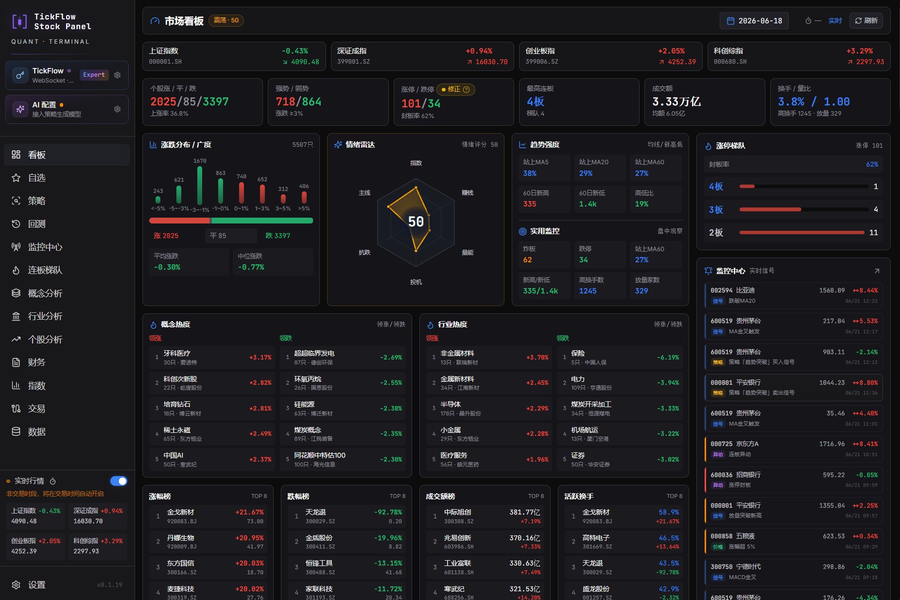

### 策略 Screener

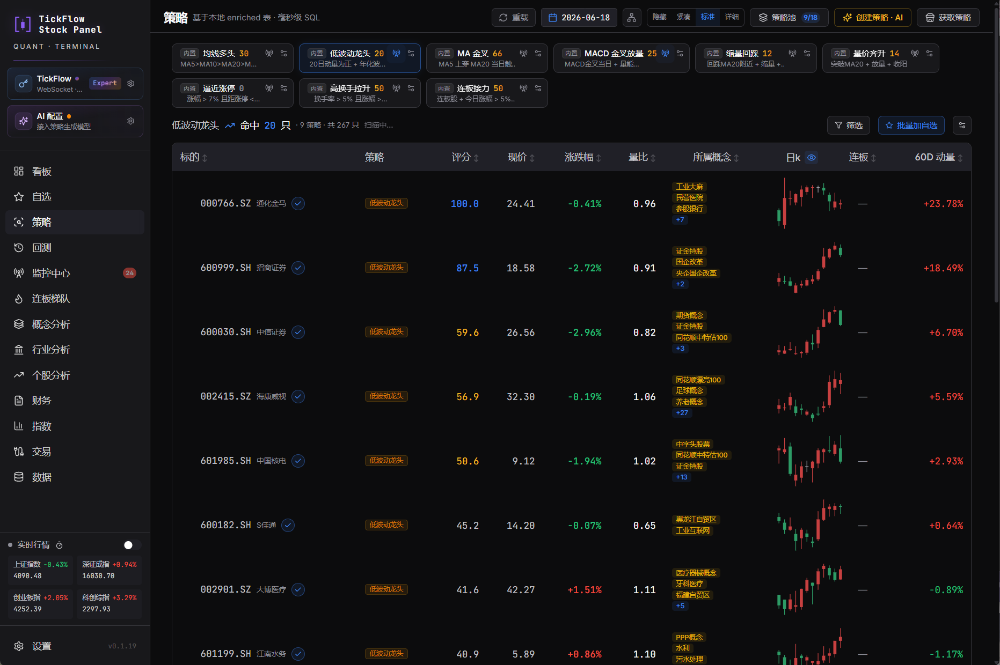

### 回测 Backtest

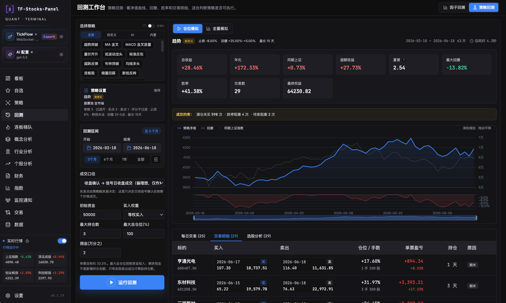

### 监控中心 Monitor

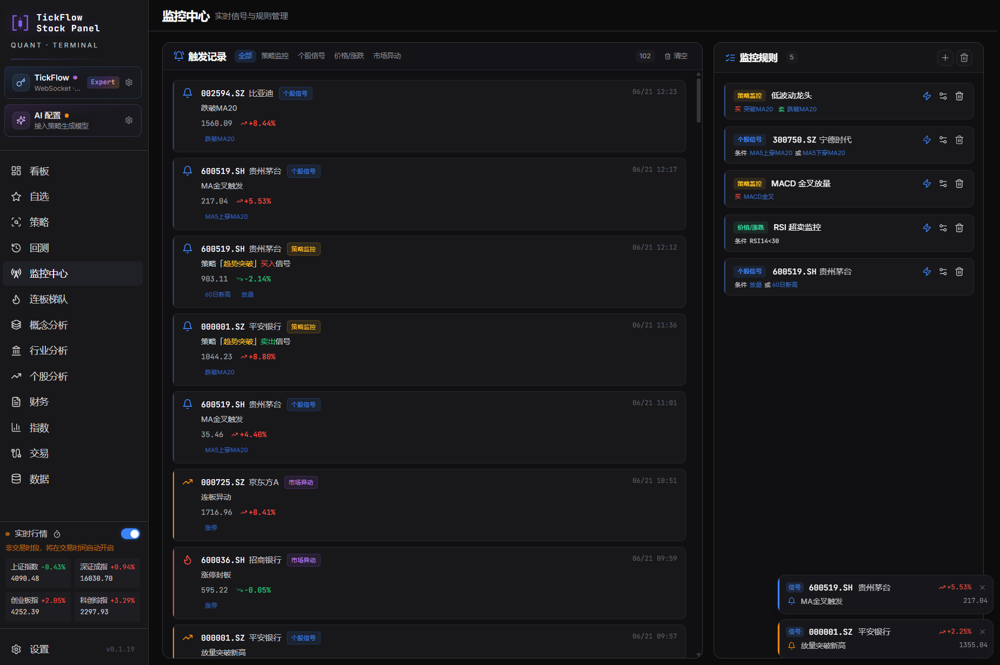

### 连板梯队 Limit Ladder

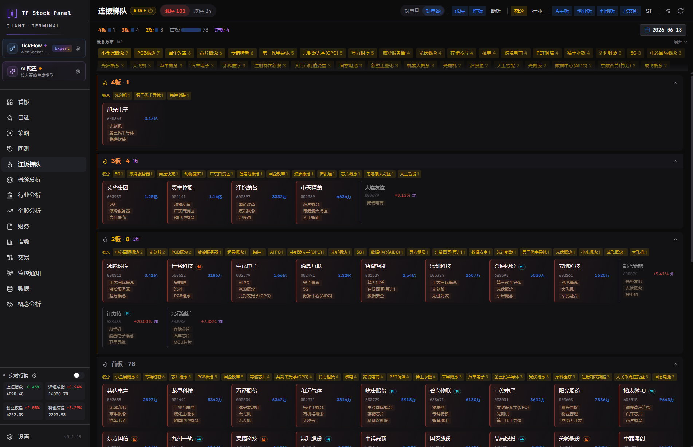

### 概念分析 Concept

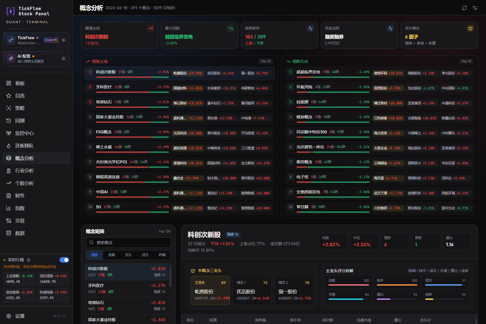

### 财务分析

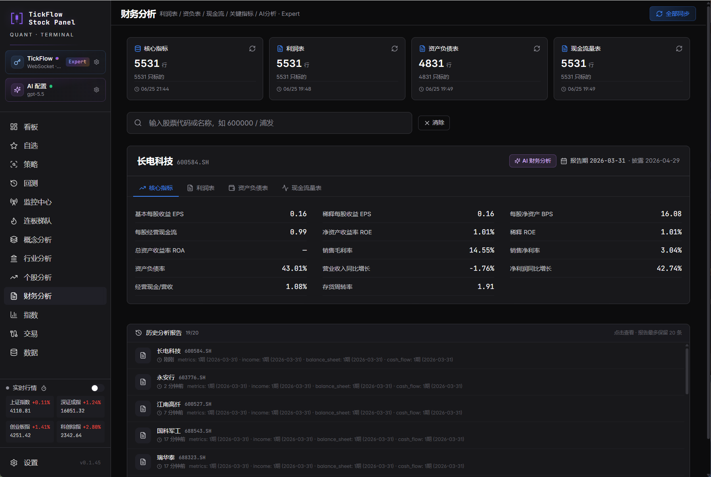

### 财务分析报告

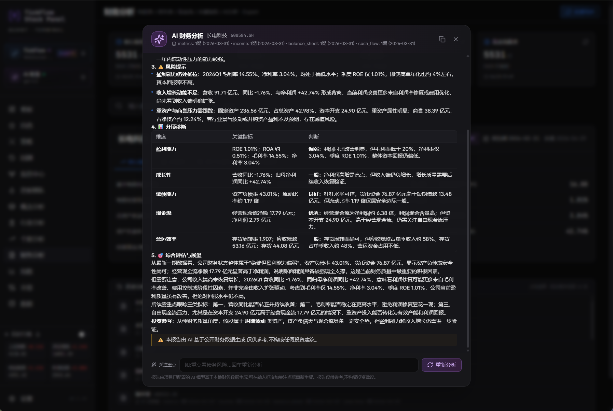

### 个股分析

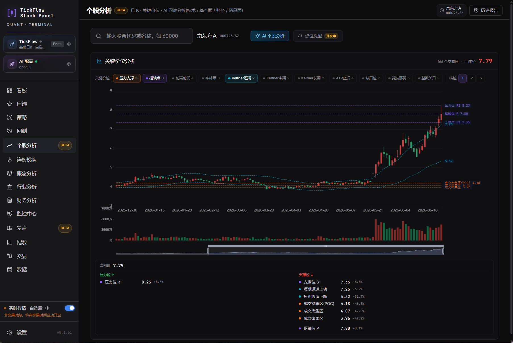

### 个股分析报告

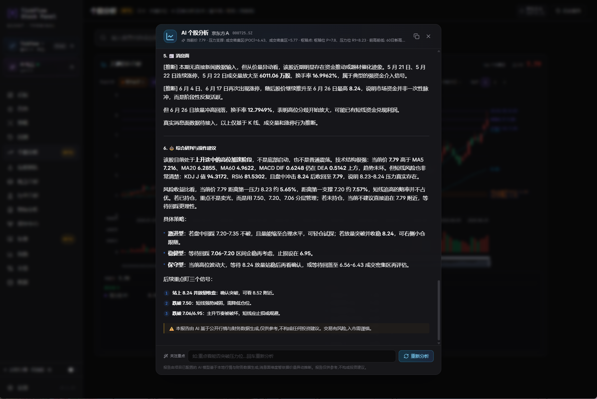

### 复盘

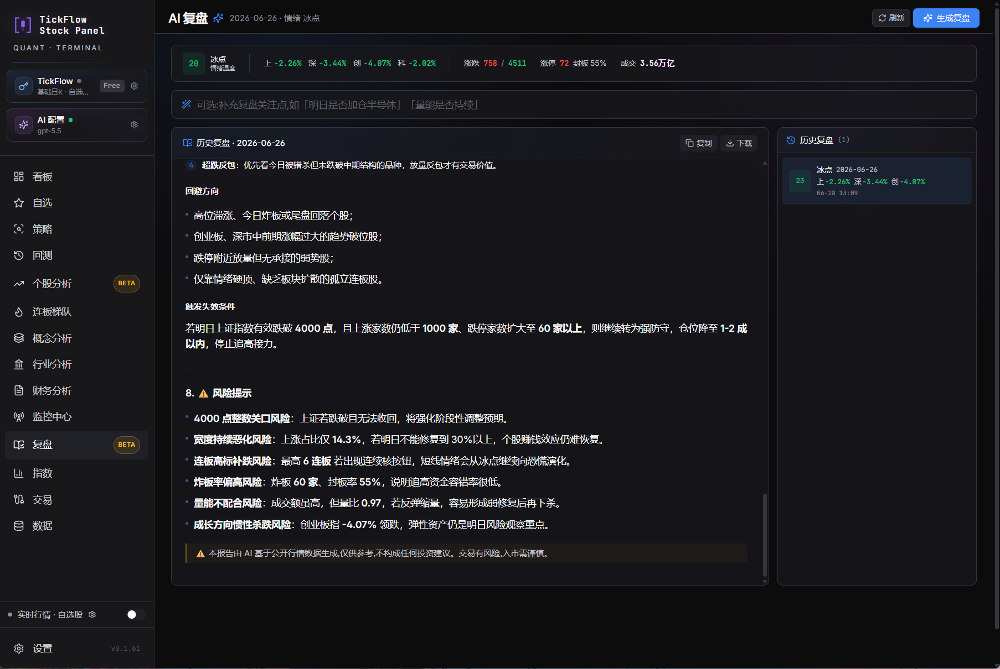

### 飞书推送-自动复盘

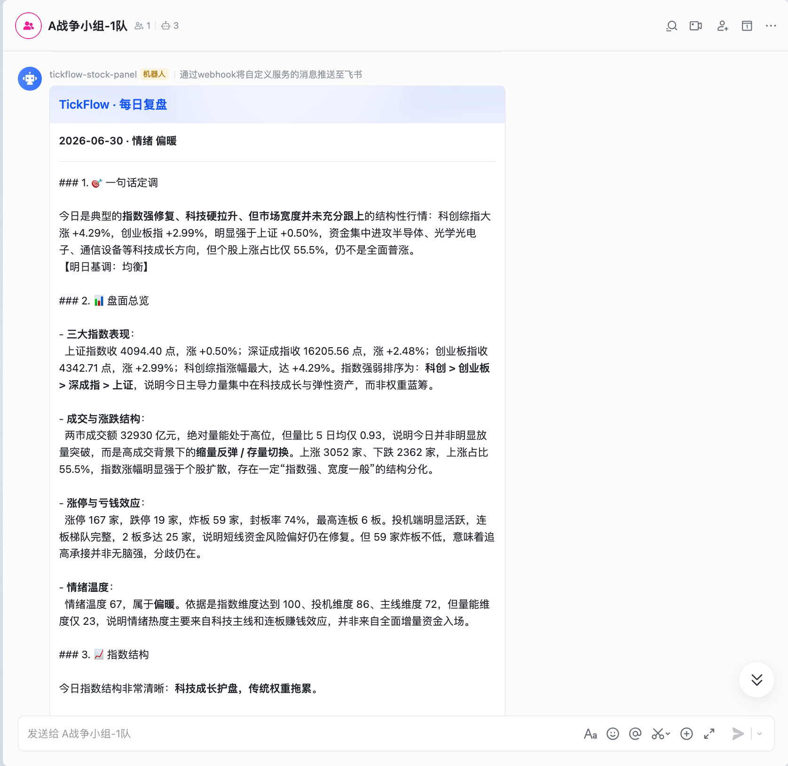

### 飞书推送-个股监控

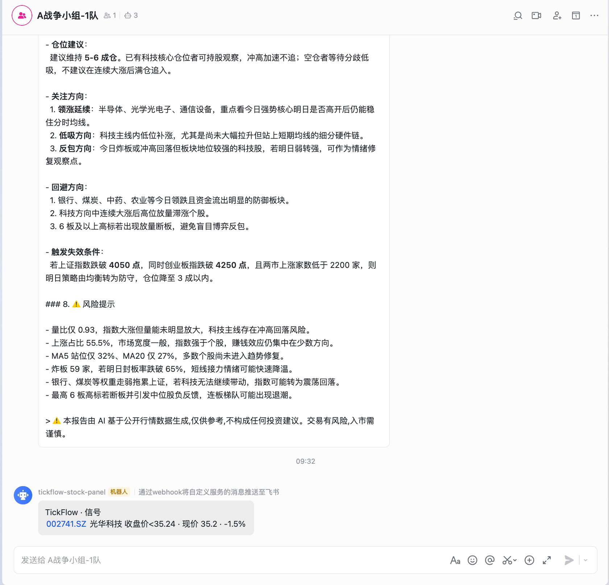

